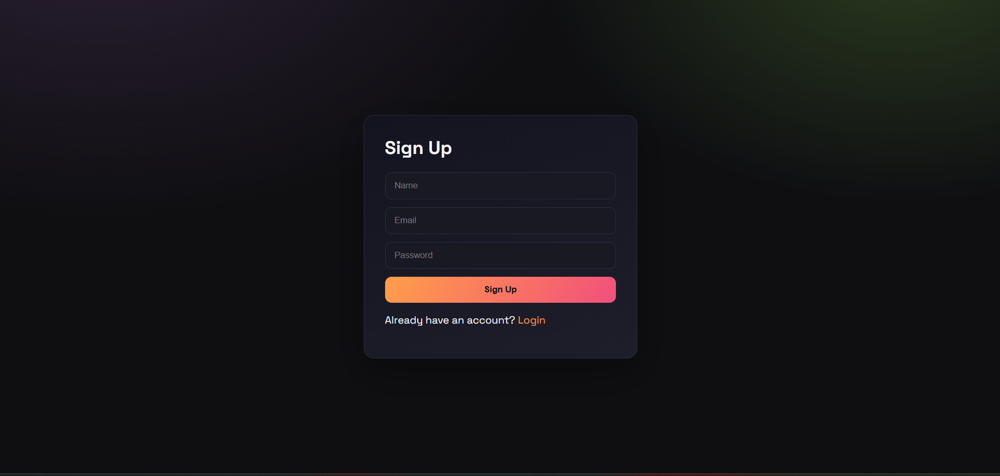
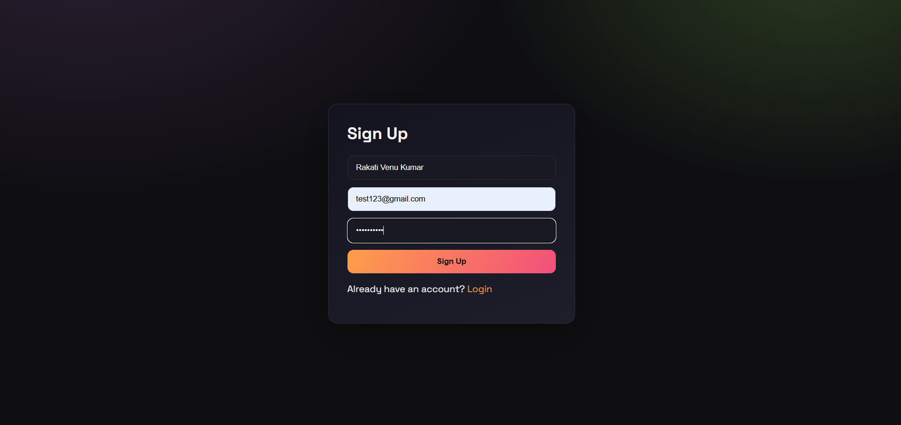
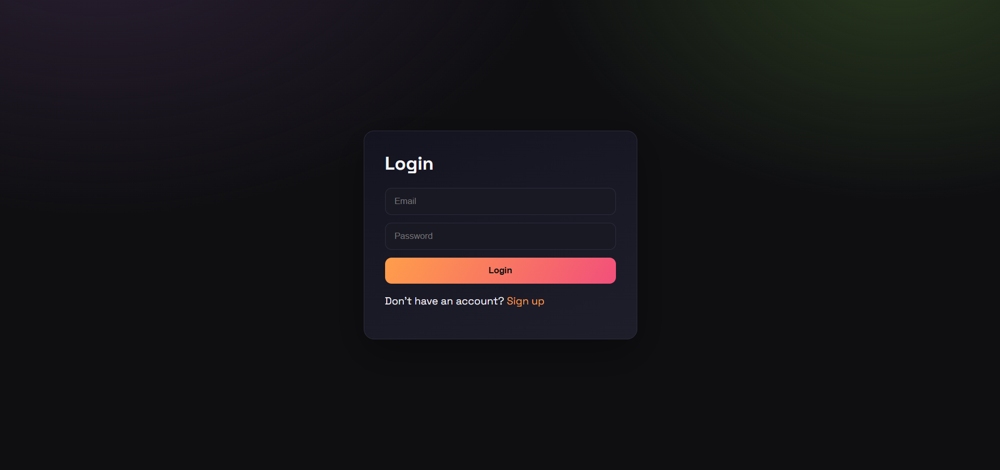
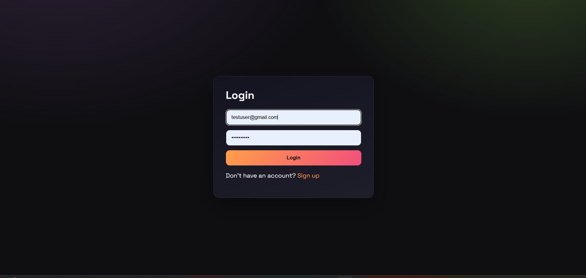
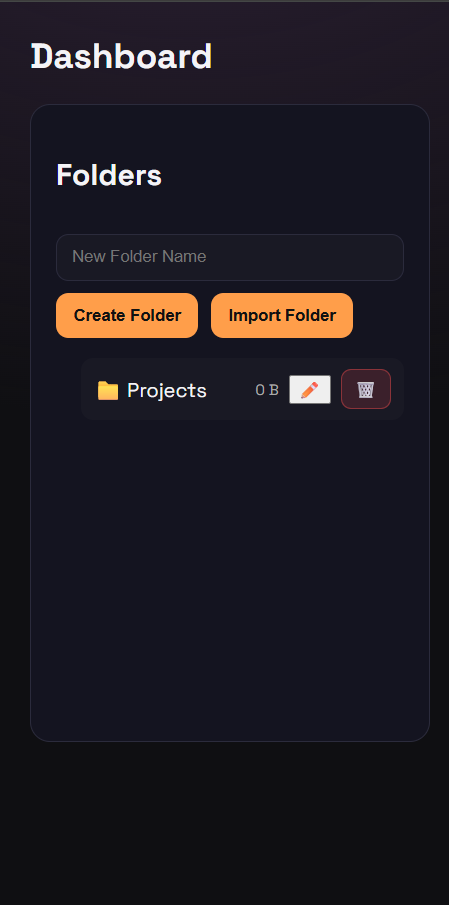
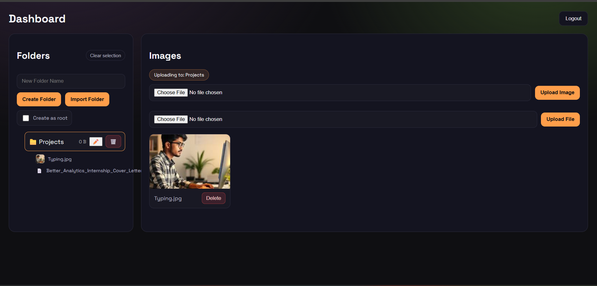
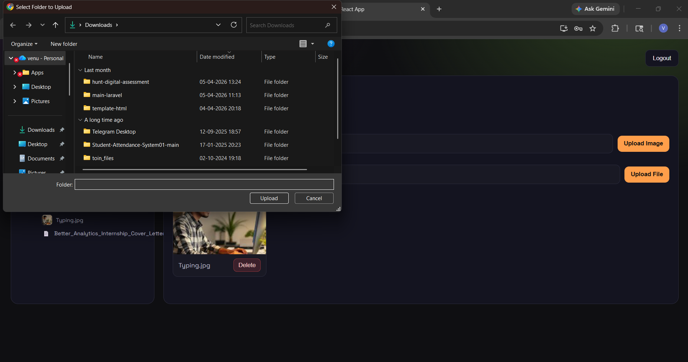
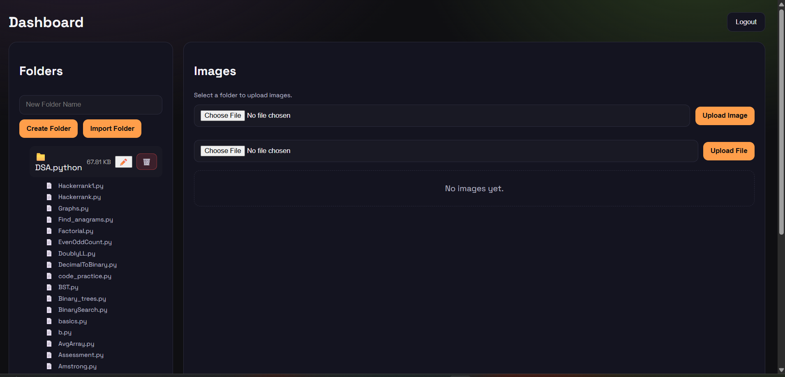
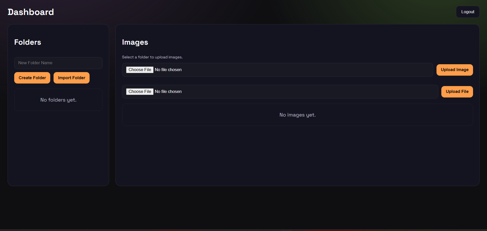

# Dobby Ads - Drive Style File Manager (Frontend)

This frontend is the UI for a Drive-style app that supports authentication, nested folders, image uploads, file uploads, and folder imports. It communicates with the backend API over HTTP and uses JWT tokens stored in `localStorage` for authenticated requests.

## Features

- User signup and login with JWT
- Nested folder tree with selection and deselection
- Create empty folders (root or nested)
- Import a local folder (uploads all files, recreates folder structure)
- Upload images and general files into a selected folder
- Show images and files under each folder in the sidebar
- Show image gallery for the selected folder
- Delete folders and images
- Folder size calculation (includes images and files)

## How It Works

- All API requests are made through a centralized Axios instance with JWT injection.
- The left sidebar displays the folder hierarchy and shows items under each folder.
- Selecting a folder determines where uploads go and which images are shown on the right.
- Import uses the folder picker to send many files in one request while preserving their relative paths. The backend recreates the directory tree and stores files under the correct parent folder.

## Environment

The frontend reads the API base URL from an optional environment variable:

```
REACT_APP_API_BASE_URL=http://localhost:5000/api
```

If not provided, it defaults to `http://localhost:5000/api`.

## Run Locally

Install dependencies and start the dev server:

```
npm install
npm start
```

The app runs at:

```
http://localhost:3000
```

## Usage Guide

1. Sign up or log in.
2. Create a root folder or select an existing folder.
3. Use Create Folder to add a child under the selected folder.
4. Use Import Folder to import a local directory and its files.
5. Upload images or files to the selected folder.
6. Use the sidebar to navigate nested folders and see file lists.

## Screenshots

### Signup




### Login




### Dashboard




### Import




### Empty State



## API Summary (Frontend Expectations)

- `POST /api/auth/signup`
- `POST /api/auth/login`
- `GET /api/folders`
- `POST /api/folders`
- `PATCH /api/folders/:folderId/rename`
- `GET /api/folders/:folderId/size`
- `POST /api/images/upload`
- `POST /api/images/import`
- `GET /api/images`
- `GET /api/images/:folderId`
- `POST /api/files/upload`
- `GET /api/files`
- `GET /api/files/:folderId`
- `DELETE /api/delete/folder/:folderId`
- `DELETE /api/delete/image/:imageId`
- `DELETE /api/delete/file/:fileId`

## Notes

- Importing large folders may take time depending on file count and size.
- For best results, always select a target folder before uploading.
- Use the Clear selection button to return to root creation mode.
